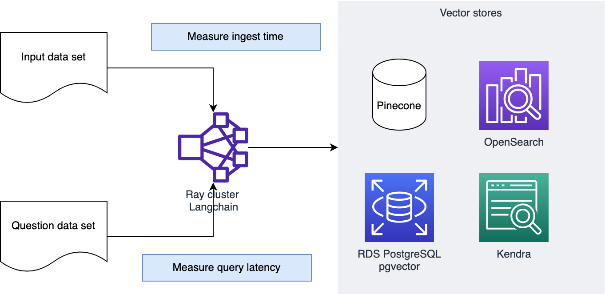
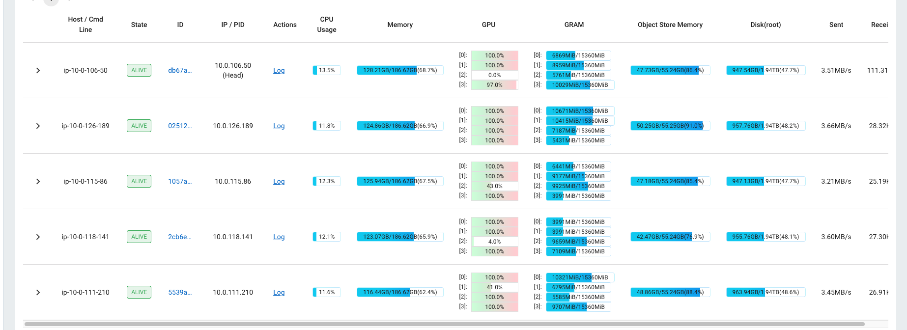

# Retrieval-augmented generation on large data sets

In this project, we attempt to answer three questions:

* Can the vector database in the RAG pattern scale to handle a large data set with tens of millions of documents?
* Where are the bottlenecks in the ingest pipeline for RAG?
* Which vector database is better in terms of cost or performance? We evaluated OpenSearch, RDS Postgres, Kendra, and Pinecone. (Kendra is not actually a vector database, but it can perform the semantic search function. It is interesting in that you don't need to produce embedding vectors with an LLM to use it.)

## Design

In order to answer these questions, we set up the data pipeline shown below.

We use a Ray cluster with 20 GPUs to run parallel ingest and query for each vector database. The Ray cluster runs an embedding model locally on each GPU.

Note that this is based on a blog from [Anyscale](https://www.anyscale.com/blog/turbocharge-langchain-now-guide-to-20x-faster-embedding).

See [the CDK instructions](cdk/README.md) for how to deploy the stack.

## Data Set

We will use two data sets:

* [Oscar](https://huggingface.co/datasets/oscar-corpus/OSCAR-2301) as the reference documents. This data set is approximately 609 million records and takes up about 4.5 TB as raw JSONL files. We scaled the dataset down to 10% (about 61 million records) to save time during processing.
* [SQUAD](https://rajpurkar.github.io/SQuAD-explorer/) to provide sample questions.

## Metrics

View the cloudwatch dashboard called 'RAG Benchmarks' to see the live results.

Observed results:

| Database | Average ingest (ms) | P99 ingest (ms) | Average query latency (ms) | P99 query latency (ms) |
| -- | -- | -- | -- | -- |
| OpenSearch | 1.4 (140 for a 100-record batch) | 7.7 (775 for a 100-record batch ) | 157 | 310 |
| RDS | 1.6 (160 for a 100-record batch) | 7.7 (770 for a 100-record batch) | 17 | 34 |
| Pinecone | 3.8 (380 for a 100-record batch) | 5.1 (510 for a 100-record batch) | 81 | 113 |
| Kendra | n/a | n/a | 100 | 475 |

You can also use the Ray dashboard to observe load on the cluster. During ingest the GPUs are running close to 100% utilization.

### Notes

* RDS: incorrect index tuning results in query latency of seconds or tens of seconds.
* Kendra: S3 crawl time is quite slow. Observed about 10 GB / day ingest rate.

## Cost estimates

See [this estimate](https://calculator.aws/#/estimate?id=50decccecabdc131b93717d3b5e7849aa2f59e57). 

* OpenSearch: $21,000 per month
* RDS: $17,000 per month

Note that:

* All prices are on-demand. 
* I was very conservative in sizing OpenSearch and RDS, so they are likely overprovisioned.

## Conclusions

1. The bottleneck in the ingest pipeline is getting the embeddings from an embedding model. Saturating GPUs is more important than fine-tuning the vector database.
2. All the vector databases performed well for a data set of this size. We had originally planned to investigate a sharded approach to the vector database, but that didn't seem to be necessary.
3. RDS may have an advantage for query latency if the index is set up properly. We used a list size of 500 and ran a `VACUUM` command after ingest.

## Improvements

* Use Spark instead of Ray. Ray is easy to get started with since you can define Python dependencies in a standard `requirements.txt` file, but using EMR would probably be more reliable than a Ray cluster running on EC2.
* Add a way to evaluate the quality of the search results from each vector database. RDS, OpenSearch, and Pinecone _should_ give similar results since they're working with the same embedding vectors. 
* Experiment with different embedding models. We used the model `all-mpnet-base-v2` which has dimension 768. The dimension and other properties of the embedding model will influence both performance and quality.

## Contributors

* David Christian
* Richa Gupta
* Prachi Kulkarni
* Justin Muller
* Randy DeFauw